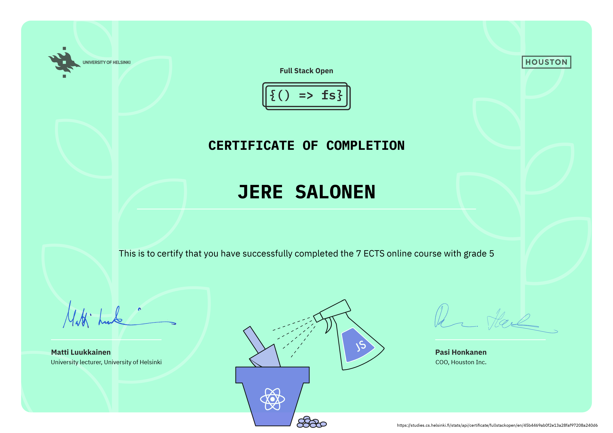
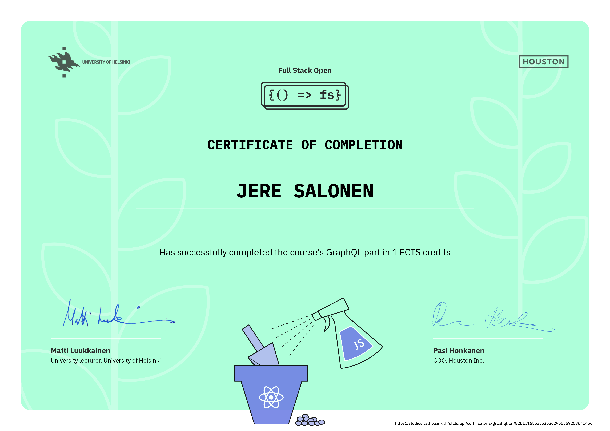

# [FullStackOpen](https://fullstackopen.com/en/) - 2021 Exercises

## Course description

This course serves as an introduction to modern web application development with JavaScript. The main focus is on building single page applications with ReactJS that use REST APIs built with Node.js. The course also contains a section on GraphQL, a modern alternative to REST APIs. ([ Read more... ](https://fullstackopen.com/en/about))

## Exercise progress

- [x] [Part 0](./part0) - Fundamentals of Web apps
- [x] [Part 1](./part1) - Introduction to React
- [x] [Part 2](./part2) - Communicating with server
- [x] [Part 3](./part3) - Programming a server with NodeJS and Express
- [x] [Part 4](./part4) - Testing Express servers, user administration
- [x] [Part 5](./part5) - Testing React apps
- [x] [Part 6](./part6) - State management with Redux
- [x] [Part 7](./part7) - React router, custom hooks, styling app with CSS and webpack
- [x] [Part 8](./part8) - GraphQL
- [x] [Part 9](./part9) - TypeScript
- [ ] Part 10 - React Native
- [x] [Part 11](https://github.com/Jeqqe/full-stack-open-pokedex) - CI/CD
- [ ] Part 12 - Containers
- [ ] Part 13 - Using relational databases

## Certificates

### Parts 1-7

### Part 8

### Part 9

### Part 11

